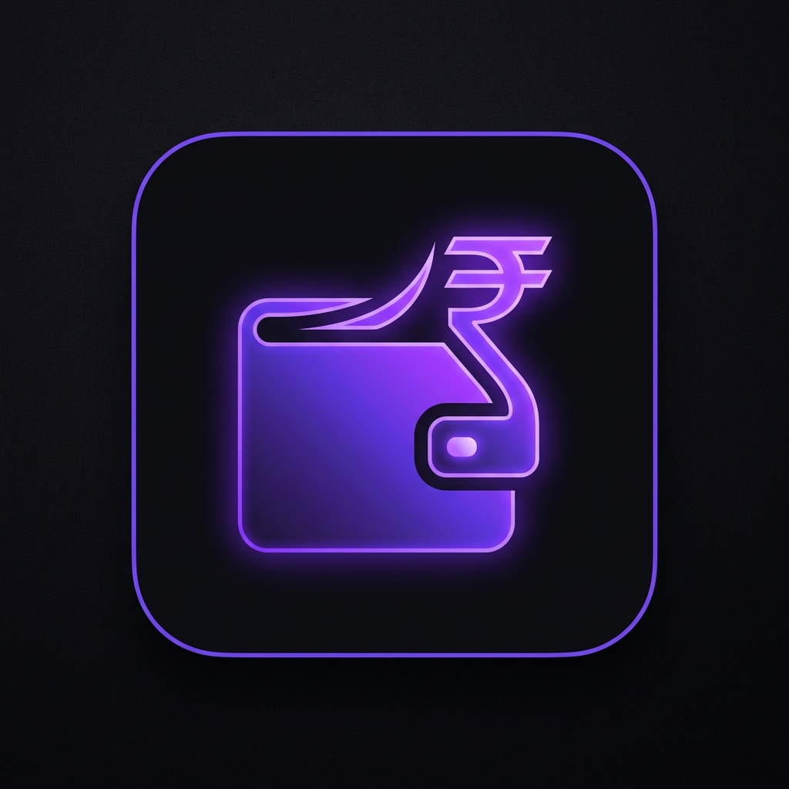
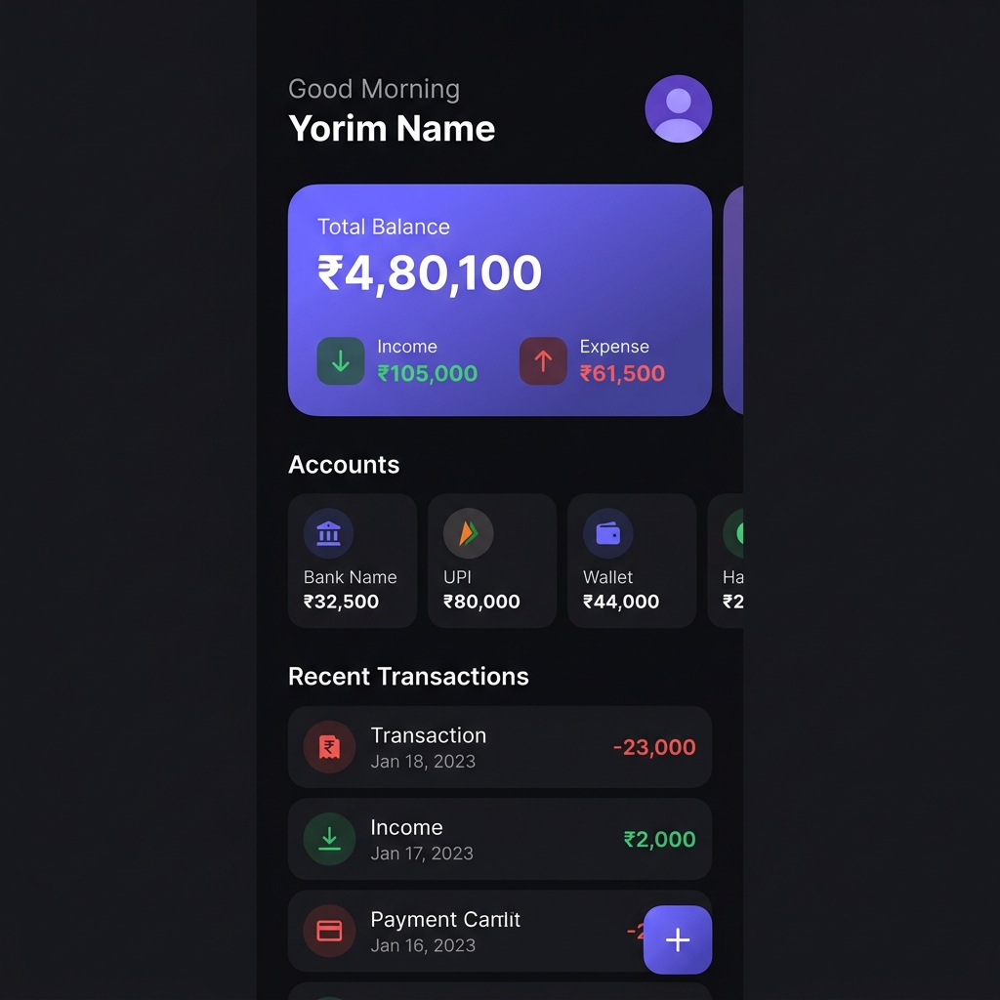
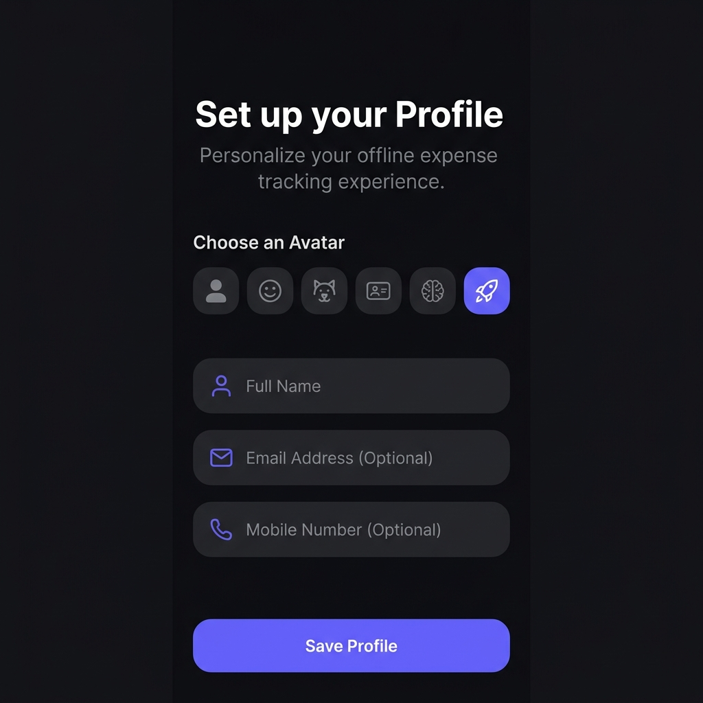
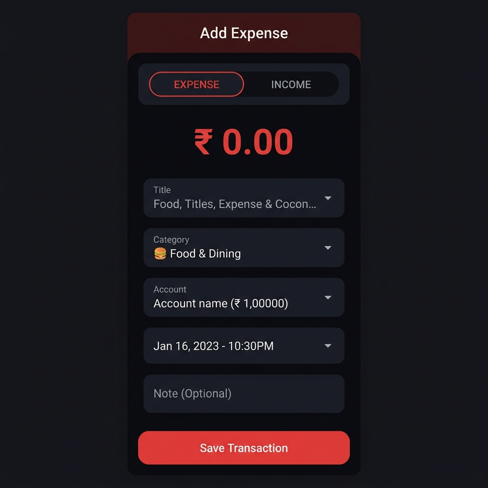
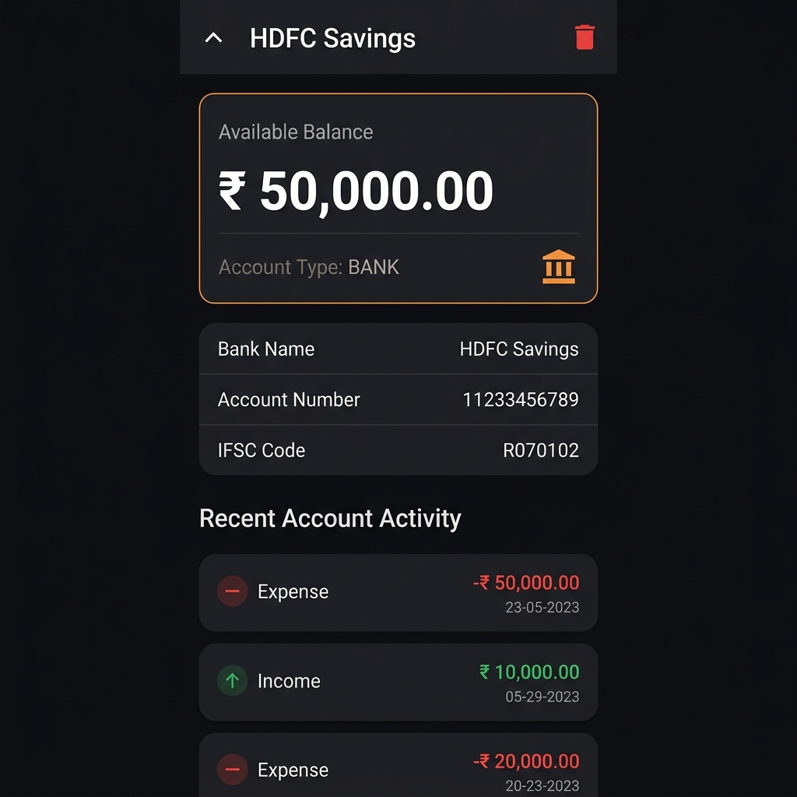
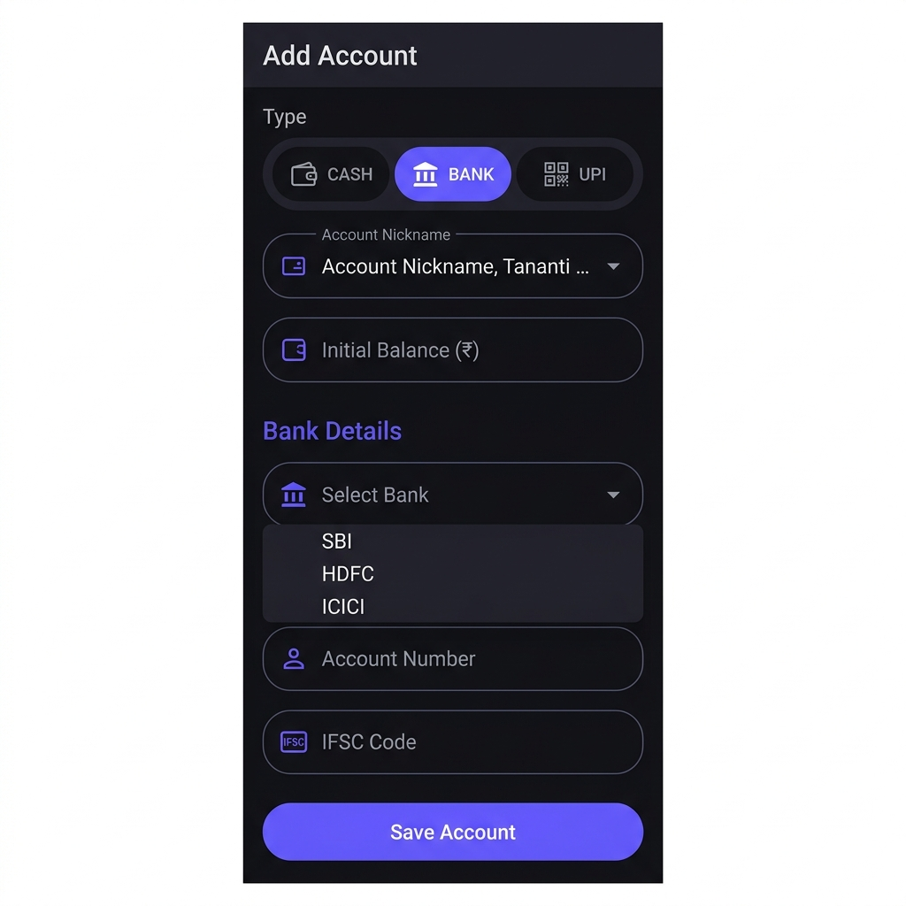
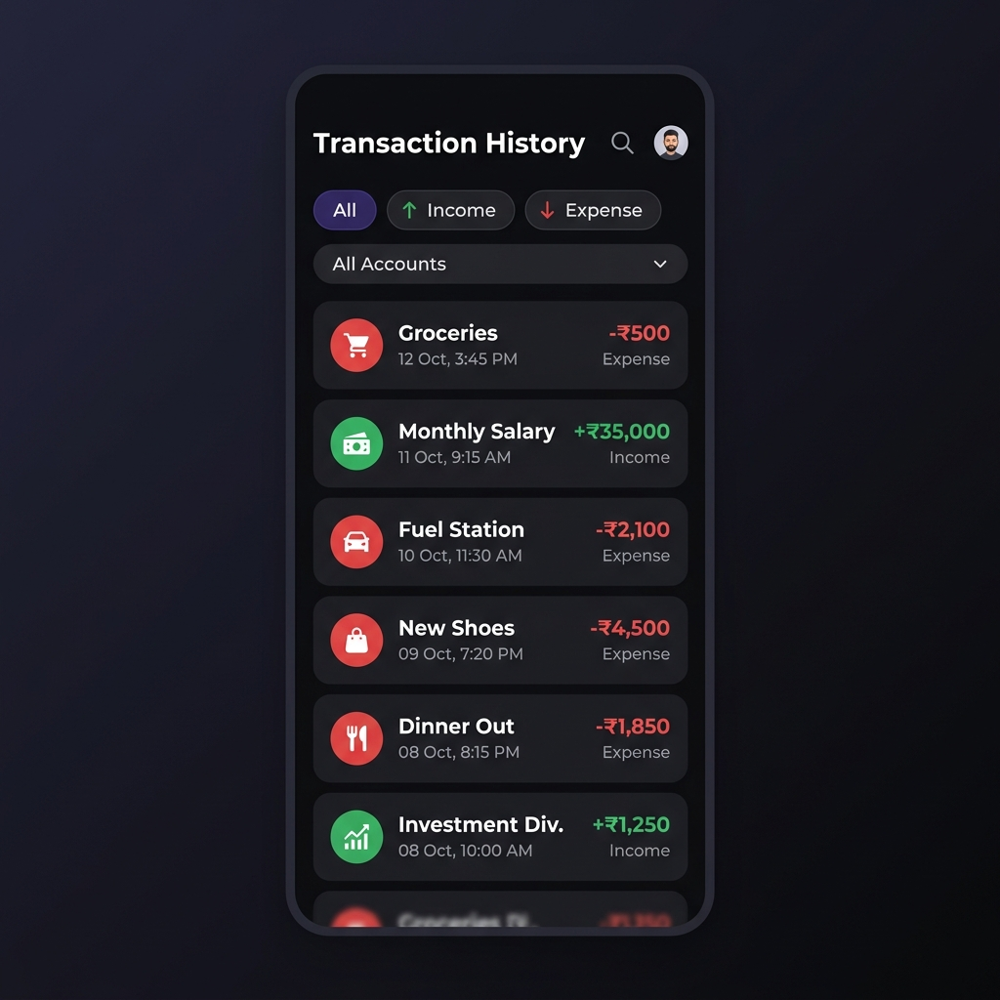
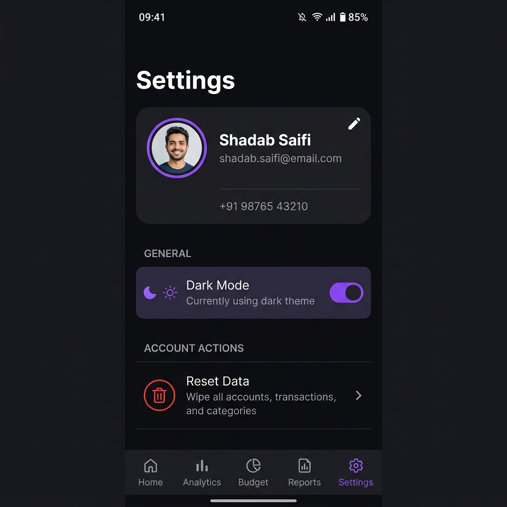

<p align="center">
  
</p>

<h1 align="center">💰 Expense Offline</h1>

<p align="center">
  <strong>A privacy-first, zero-internet personal finance companion built entirely with Flutter & Drift ORM.</strong>
</p>

<p align="center">
  
  
  
  
  
  
  
</p>

<p align="center">
  <em>No cloud. No subscriptions. No tracking. Your money, your data, your device.</em>
</p>

---

## 📖 Table of Contents

- [✨ Why Expense Offline?](#-why-expense-offline)
- [🎬 App Screenshots](#-app-screenshots)
- [🚀 Key Features](#-key-features)
- [🏗️ Architecture & Design Patterns](#️-architecture--design-patterns)
- [🛠️ Tech Stack](#️-tech-stack)
- [📐 Database Schema](#-database-schema)
- [⚡ Performance & Optimization](#-performance--optimization)
- [📂 Project Structure](#-project-structure)
- [🏃 Getting Started](#-getting-started)
- [🗺️ Roadmap](#️-roadmap)
- [🤝 Contributing](#-contributing)
- [📜 License](#-license)

---

## ✨ Why Expense Offline?

Most finance apps require an internet connection, collect your data, and lock features behind paywalls. **Expense Offline** takes a fundamentally different approach:

| Problem | Our Solution |
|---|---|
| 🔐 Privacy concerns with cloud-synced apps | **100% offline** — data never leaves your device |
| 📶 No internet in rural areas / metro tunnels | Works **everywhere**, anytime, zero network dependency |
| 💸 Paid subscriptions for basic tracking | **Completely free**, no ads, no premium tiers |
| 🐌 Bloated apps with unnecessary features | **Lean & fast** — focused on what matters |
| 🔋 Background sync drains battery | **Zero background processes**, minimal battery impact |

---

## 🎬 App Screenshots

<table>
  <tr>
    <td align="center"><strong>Splash Screen</strong></td>
    <td align="center"><strong>Home Dashboard</strong></td>
    <td align="center"><strong>Profile Setup</strong></td>
    <td align="center"><strong>Add Transaction</strong></td>
  </tr>
  <tr>
    <td></td>
    <td></td>
    <td></td>
    <td></td>
  </tr>
  <tr>
    <td align="center"><strong>Account Detail</strong></td>
    <td align="center"><strong>Add Account</strong></td>
    <td align="center"><strong>Transaction History</strong></td>
    <td align="center"><strong>Settings</strong></td>
  </tr>
  <tr>
    <td></td>
    <td></td>
    <td></td>
    <td></td>
  </tr>
</table>

---

## 🚀 Key Features

### 💳 Multi-Account Management
- Support for **Bank Accounts**, **UPI Wallets**, and **Cash** — all in one place
- Pre-loaded list of **22+ Indian banks** (SBI, HDFC, ICICI, Axis, etc.) for quick setup
- Pre-configured **UPI app suggestions** (GPay, PhonePe, Paytm, BHIM, etc.)
- Smart **auto-nickname generation** based on selected bank/UPI app
- Track individual account balances with **real-time updates**

### 📊 Transaction Tracking
- Full **Income & Expense** categorization with intuitive toggle UI
- **25+ pre-defined expense titles** (Groceries, Rent, Bills, etc.) with custom entry support
- **15+ emoji-rich categories** (🍔 Food, 🚗 Transport, 💊 Health, etc.) for visual clarity
- **Insufficient balance detection** — warns before overspending with detailed shortfall breakdown
- **Atomic balance updates** — every transaction insert/delete runs inside a database transaction to guarantee data integrity

### 🔍 Smart Filtering & History
- Filter transactions by **type** (Income / Expense / All)
- Filter by **specific account** via dropdown
- Full transaction history with **date + time stamps**
- **Long-press to delete** with confirmation dialog and automatic balance reversal

### 👤 Profile System
- First-time onboarding with **avatar picker** (6 unique icons)
- **Form validation** — email regex, 10-digit Indian mobile validation, name length checks
- Edit profile anytime from Settings with pre-filled data
- Profile state persisted and loaded into memory at app start

### 🎨 Theming & UI
- **Dark Mode (default)** with handcrafted color palette (`#0F0F13` base, `#1E1E24` cards, `#6C63FF` accent)
- **Light Mode** with matching Material 3 design
- Global **ThemeProvider** for seamless runtime switching
- Animated splash screen with **fade transitions** and custom icon glow
- Gradient balance cards, colored account borders, and micro-animations throughout
- **Material 3** design language with `ColorScheme.fromSeed`

### ⚙️ Settings & Data Management
- One-tap **Dark/Light theme toggle** with persistence
- **Full data reset** with confirmation dialog — wipes all accounts, transactions, and categories
- Profile editing with instant UI refresh via Provider's `notifyListeners()`

---

## 🏗️ Architecture & Design Patterns

```
┌─────────────────────────────────────────────────┐
│                   PRESENTATION                   │
│                                                  │
│  ┌──────────┐  ┌──────────┐  ┌──────────┐       │
│  │  Screen   │  │  Screen   │  │  Screen   │      │
│  │  Widgets  │  │  Widgets  │  │  Widgets  │      │
│  └─────┬────┘  └─────┬────┘  └─────┬────┘       │
│        │             │             │              │
│        └─────────────┼─────────────┘              │
│                      │                            │
│              ┌───────▼───────┐                    │
│              │   Providers    │ ◄── ChangeNotifier │
│              │ (State Mgmt)  │                    │
│              └───────┬───────┘                    │
├──────────────────────┼──────────────────────────-─┤
│                  DATA LAYER                       │
│              ┌───────▼───────┐                    │
│              │  Repositories  │                    │
│              └───────┬───────┘                    │
│              ┌───────▼───────┐                    │
│              │   Drift ORM    │ ◄── Type-safe SQL  │
│              │  (AppDatabase) │                    │
│              └───────┬───────┘                    │
│              ┌───────▼───────┐                    │
│              │    SQLite DB   │ ◄── Local Storage  │
│              └───────────────┘                    │
└───────────────────────────────────────────────────┘
```

### Design Patterns Used

| Pattern | Where | Why |
|---|---|---|
| **Provider + ChangeNotifier** | `ExpenseProvider`, `ProfileProvider`, `ThemeProvider` | Efficient, granular UI rebuilds using `Consumer<T>` — only rebuilds widgets that actually depend on changed data |
| **Repository Pattern** | `ExpenseRepository` | Abstracts data source from business logic, making it easy to swap backends (e.g., Hive, Isar) |
| **Feature-First Architecture** | `lib/features/expense/` | Each feature is self-contained with its own models, providers, repos, and UI — scales cleanly as app grows |
| **Singleton Database** | `AppDatabase` via `Provider<AppDatabase>` | One shared DB instance across the entire widget tree, properly disposed on app exit |
| **Atomic Transactions** | `db.transaction(() async {...})` | All balance-modifying operations wrapped in DB transactions — no partial writes on crash |
| **Companion Objects** | `TransactionsCompanion`, `AccountsCompanion` | Drift's type-safe insert/update mechanism — compile-time guarantees against schema mismatches |

---

## 🛠️ Tech Stack

| Layer | Technology | Version | Purpose |
|---|---|---|---|
| **Framework** | Flutter | `3.10+` | Cross-platform UI toolkit |
| **Language** | Dart | `^3.10.4` | Null-safe, type-safe programming |
| **State Management** | Provider | `^6.1.5` | Lightweight, scalable state management with `MultiProvider` |
| **Database ORM** | Drift | `^2.14.0` | Type-safe, reactive SQLite wrapper with code generation |
| **SQLite Engine** | sqlite3_flutter_libs | `^0.5.18` | Native SQLite bindings for all platforms |
| **SQLite Helper** | sqflite | `^2.4.2` | Database path resolution |
| **Date Formatting** | intl | `^0.20.2` | Locale-aware date/time/currency formatting |
| **Code Generation** | build_runner + drift_dev | `^2.4.0` / `^2.14.0` | Compile-time safe database code generation |
| **App Icons** | flutter_launcher_icons | `^0.14.3` | Automated adaptive icon generation for Android & iOS |
| **Design System** | Material 3 | Built-in | Modern design language with `ColorScheme.fromSeed` |

---

## 📐 Database Schema

The app uses a **6-table relational schema** with foreign key constraints and cascading deletes:

```sql
┌────────────────┐       ┌──────────────────┐
│    Profiles     │       │    Categories     │
├────────────────┤       ├──────────────────┤
│ profileId (PK) │       │ categoryId (PK)  │
│ name           │       │ categoryName     │
│ email?         │       │ categoryType?    │
│ mobile?        │       │  (INCOME/EXPENSE)│
│ profileImage?  │       └──────────────────┘
│ createdAt      │              │
└────────────────┘              │ FK
                                ▼
┌────────────────┐       ┌──────────────────┐
│   Accounts     │◄──FK──│  Transactions    │
├────────────────┤       ├──────────────────┤
│ accountId (PK) │       │ transactionId(PK)│
│ accountName    │       │ accountId (FK)   │
│ accountType    │       │ categoryId (FK?) │
│  (BANK/UPI/    │       │ title            │
│   CASH)        │       │ amount           │
│ balance        │       │ transactionType  │
│ currency (INR) │       │  (INCOME/EXPENSE)│
│ isActive       │       │ note?            │
│ createdAt      │       │ referenceId?     │
│ updatedAt?     │       │ transactionStatus│
└───────┬────────┘       │ transactionDate  │
        │                │ createdAt        │
   ┌────┴─────┐          │ updatedAt?       │
   │          │          │ isDeleted        │
   ▼          ▼          └──────────────────┘
┌──────────┐ ┌──────────┐
│  Bank    │ │   UPI    │
│ Accounts │ │ Accounts │
├──────────┤ ├──────────┤
│bankId(PK)│ │upiId(PK) │
│accountId │ │accountId  │
│ (FK,UNQ) │ │ (FK,UNQ)  │
│bankName  │ │upiAddress │
│accountNo │ │ (UNIQUE)  │
│ (UNIQUE) │ │upiName?   │
│ifscCode  │ │userName?  │
│holderName│ │mobileNo?  │
│bankAccTyp│ │linkedBank?│
│createdAt │ │createdAt  │
└──────────┘ └──────────┘
```

**Key Design Decisions:**
- `ON DELETE CASCADE` on `BankAccounts` and `UpiAccounts` — deleting an account auto-removes linked metadata
- `UNIQUE` constraints on account numbers and UPI addresses — prevents duplicate entries
- `isDeleted` soft-delete flag on transactions — supports future "undo" or "trash" features
- `transactionStatus` (PENDING/COMPLETED/FAILED) — ready for future payment tracking integrations
- `PRAGMA foreign_keys = ON` explicitly enabled in migration strategy

---

## ⚡ Performance & Optimization

### 🧠 State Management Efficiency
- **`Consumer<T>` instead of `Provider.of<T>`** — only rebuilds the exact widget subtree that depends on the data, not the entire screen
- **In-memory profile caching** — profile loaded once at splash, served from RAM on all subsequent reads
- **Lazy database initialization** — `LazyDatabase` defers SQLite connection until first query, speeding up cold starts

### 💾 Database Optimization
- **Background database creation** — `NativeDatabase.createInBackground(file)` moves DB I/O off the main isolate
- **Atomic transactions** — all balance mutations wrapped in `db.transaction()` to prevent data corruption on crash or interruption
- **Compile-time type safety** — Drift's code generation catches schema errors at build time, eliminating runtime SQL bugs
- **Efficient ordering** — transactions sorted by `transactionDate DESC` at the query level, not in Dart code

### 🎨 UI Performance
- **`CustomScrollView` + `SliverList`** — home screen uses sliver-based lazy rendering, only building visible transaction tiles
- **`addPostFrameCallback`** — data fetching deferred until after first frame paint, ensuring smooth splash-to-home transition
- **Minimal widget rebuilds** — each provider has a focused scope (`ExpenseProvider`, `ProfileProvider`, `ThemeProvider`) instead of a single god-provider
- **Const constructors** — used throughout for compile-time widget optimization

### 📦 App Size
- No heavy dependencies (no Firebase, no network libraries, no image processing)
- Single-purpose packages only — keeps APK/IPA lean and install-fast

---

## 📂 Project Structure

```
lib/
├── main.dart                          # App entry point, MultiProvider setup, MaterialApp config
│
├── core/
│   └── database/
│       ├── tables.dart                # 6 Drift table definitions (Profiles, Accounts, etc.)
│       ├── app_database.dart          # DriftDatabase class, migration strategy, connection setup
│       └── app_database.g.dart        # Auto-generated type-safe database code
│
└── features/
    └── expense/
        ├── models/                    # Data models (reserved for DTOs/ViewModels)
        │
        ├── providers/
        │   ├── expense_provider.dart  # Accounts, Transactions, Balance logic
        │   ├── profile_provider.dart  # Profile CRUD with in-memory caching
        │   └── theme_provider.dart    # Dark/Light mode toggling
        │
        ├── repositories/
        │   └── expense_repository.dart # Data access abstraction layer
        │
        └── ui/
            └── screens/
                ├── splash_screen.dart            # Animated splash with profile-check routing
                ├── profile_setup_screen.dart      # Onboarding + Edit profile with validation
                ├── home_screen.dart               # Dashboard: balance card, accounts, transactions
                ├── account_list_screen.dart       # All accounts with type-based icons & colors
                ├── account_detail_screen.dart     # Account info, metadata, linked transactions
                ├── add_account_screen.dart        # CASH/BANK/UPI creation with smart suggestions
                ├── add_transaction_screen.dart    # Income/Expense entry with category & validation
                ├── transaction_history_screen.dart # Filtered transaction list with search
                └── settings_screen.dart           # Profile card, theme toggle, data reset
```

---

## 🏃 Getting Started

### Prerequisites

- Flutter SDK `3.10+`
- Dart SDK `^3.10.4`
- Android Studio / VS Code with Flutter extension
- An Android emulator or physical device

### Installation

```bash
# 1. Clone the repository
git clone https://github.com/ShadabXaifi/Expense-Tracker-App.git
cd Expense-Tracker-App

# 2. Install dependencies
flutter pub get

# 3. Generate Drift database code
dart run build_runner build --delete-conflicting-outputs

# 4. Run the app
flutter run
```

### Build for Release

```bash
# Android APK
flutter build apk --release

# Android App Bundle (for Play Store)
flutter build appbundle --release

# iOS (requires macOS + Xcode)
flutter build ios --release
```

---

## 🗺️ Roadmap

- [x] Multi-account management (Bank, UPI, Cash)
- [x] Income & Expense tracking with categories
- [x] Dark/Light theme support
- [x] Profile onboarding with avatar picker
- [x] Atomic balance updates with DB transactions
- [x] Insufficient balance warnings
- [x] Transaction filtering by type and account
- [ ] 📊 Monthly/weekly spending charts & analytics
- [ ] 🔔 Bill reminders & recurring transactions
- [ ] 📤 Export to CSV/PDF
- [ ] 🔒 App lock with biometrics (fingerprint/face)
- [ ] 💱 Multi-currency support
- [ ] 📸 Receipt photo attachment via camera
- [ ] 🗑️ Trash/undo deleted transactions (soft delete already in schema)
- [ ] 🌐 Optional encrypted cloud backup

---

## 🤝 Contributing

Contributions are welcome! Please feel free to submit a Pull Request.

1. **Fork** the repository
2. **Create** your feature branch (`git checkout -b feature/amazing-feature`)
3. **Commit** your changes (`git commit -m 'Add some amazing feature'`)
4. **Push** to the branch (`git push origin feature/amazing-feature`)
5. **Open** a Pull Request

---

## 📜 License

This project is licensed under the MIT License — see the [LICENSE](LICENSE) file for details.

---

<p align="center">
  <strong>Built with ❤️ by <a href="https://github.com/ShadabXaifi">Shadab Saifi</a></strong>
</p>

<p align="center">
  <em>If this project helped you, consider giving it a ⭐ on GitHub!</em>
</p>
